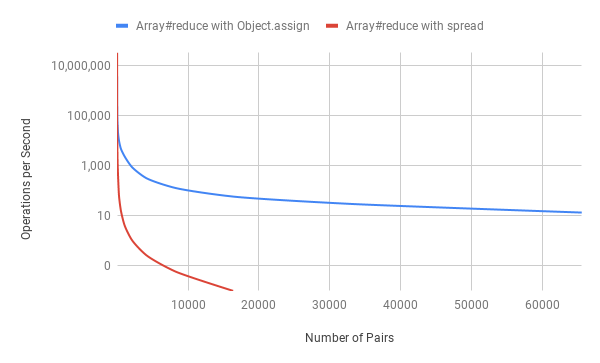

# Alternatives to Object.fromEntries

Working with code that needs `Object.fromEntries`, but don't have that access to the new hotness? Wondering which of your alternatives is better?

**You're in luck!** I did a science, and compared the following alternatives.

```javascript
const pairs = [['abc', 'def'], ['ghi', 'jkl']]
```

## Reduction using `Object.assign`

```javascript
function withObjectAssign(object, [key, value]) {
  return Object.assign(object, {[key]: value})
}

pairs.reduce(withObjectAssign, {})
```

## Reduction using spreading

```javascript
function withSpread(object, [key, value]) {
  return {...object, [key]: value}
}

pairs.reduce(withObjectAssign, {})
```

## TL;DR

Using `Object.assign` is faster for 4 or more pairs.

## Details

I used the `benchmark.js` library to compare both alternatives against progressively larger arrays of randomly generated pairs. Both algorithms operated on the same arrays. See index.js for details. I then produced a CSV by parsing the output in Ruby, since I wouldn't have to google how to work with CSVs in Javascript. 🤷‍♂️ I then imported the CSV into Google Sheets to produce a chart, for which I had to use a logarithmic axis to show anything meaningful.



Interestingly enough, spreading seems to be significantly faster for few pairs, but `Object.assign` quickly overtakes it and leaves it in the dust.

### Data

<table>
  <theader>
    <tr>
      <th rowspan="2">Pairs</th>
      <th colspan="3">Array#reduce with Object.assign</th>
      <th colspan="3">Array#reduce with spread</th>
    </tr>
    <tr>
      <th>Operations/Second</th>
      <th>Margin of Error</th>
      <th>Runs Sampled</th>
      <th>Operations/Second</th>
      <th>Margin of Error</th>
      <th>Runs Sampled</th>
    </tr>
  </theader>
  <tbody>
    <tr>
      <td>1</td>
      <td>3,648,018</td>
      <td>6.19%</td>
      <td>76</td>
      <td>31,902,743</td>
      <td>1.68%</td>
      <td>91</td>
    </tr>
    <tr>
      <td>2</td>
      <td>2,071,849</td>
      <td>1.68%</td>
      <td>89</td>
      <td>2,614,504</td>
      <td>1.00%</td>
      <td>91</td>
    </tr>
    <tr>
      <td>4</td>
      <td>1,033,665</td>
      <td>1.75%</td>
      <td>86</td>
      <td>460,205</td>
      <td>1.31%</td>
      <td>91</td>
    </tr>
    <tr>
      <td>8</td>
      <td>464,986</td>
      <td>1.73%</td>
      <td>89</td>
      <td>146,739</td>
      <td>0.78%</td>
      <td>90</td>
    </tr>
    <tr>
      <td>16</td>
      <td>215,530</td>
      <td>2.30%</td>
      <td>89</td>
      <td>37,346</td>
      <td>1.59%</td>
      <td>89</td>
    </tr>
    <tr>
      <td>32</td>
      <td>85,912</td>
      <td>2.02%</td>
      <td>88</td>
      <td>9,022</td>
      <td>2.05%</td>
      <td>90</td>
    </tr>
    <tr>
      <td>64</td>
      <td>45,157</td>
      <td>1.30%</td>
      <td>92</td>
      <td>2,038</td>
      <td>1.90%</td>
      <td>87</td>
    </tr>
    <tr>
      <td>128</td>
      <td>21,248</td>
      <td>1.54%</td>
      <td>86</td>
      <td>468</td>
      <td>1.18%</td>
      <td>86</td>
    </tr>
    <tr>
      <td>256</td>
      <td>10,401</td>
      <td>0.98%</td>
      <td>90</td>
      <td>71.43</td>
      <td>1.85%</td>
      <td>72</td>
    </tr>
    <tr>
      <td>512</td>
      <td>4,957</td>
      <td>1.89%</td>
      <td>87</td>
      <td>17.62</td>
      <td>0.78%</td>
      <td>47</td>
    </tr>
    <tr>
      <td>1024</td>
      <td>2,441</td>
      <td>1.36%</td>
      <td>87</td>
      <td>4.43</td>
      <td>1.07%</td>
      <td>15</td>
    </tr>
    <tr>
      <td>2048</td>
      <td>909</td>
      <td>2.27%</td>
      <td>87</td>
      <td>1.12</td>
      <td>1.96%</td>
      <td>7</td>
    </tr>
    <tr>
      <td>4096</td>
      <td>320</td>
      <td>2.04%</td>
      <td>80</td>
      <td>0.27</td>
      <td>2.02%</td>
      <td>5</td>
    </tr>
    <tr>
      <td>8192</td>
      <td>129</td>
      <td>3.15%</td>
      <td>72</td>
      <td>0.06</td>
      <td>2.94%</td>
      <td>5</td>
    </tr>
    <tr>
      <td>16384</td>
      <td>58.17</td>
      <td>3.33%</td>
      <td>60</td>
      <td>0.01</td>
      <td>4.88%</td>
      <td>5</td>
    </tr>
    <tr>
      <td>32768</td>
      <td>29.84</td>
      <td>2.82%</td>
      <td>52</td>
      <td>0.00</td>
      <td>4.16%</td>
      <td>5</td>
    </tr>
    <tr>
      <td>65536</td>
      <td>13.40</td>
      <td>3.90%</td>
      <td>37</td>
      <td>0.00</td>
      <td>2.97%</td>
      <td>5</td>
    </tr>
  </tbody>
</table>

Thanks for reading!
